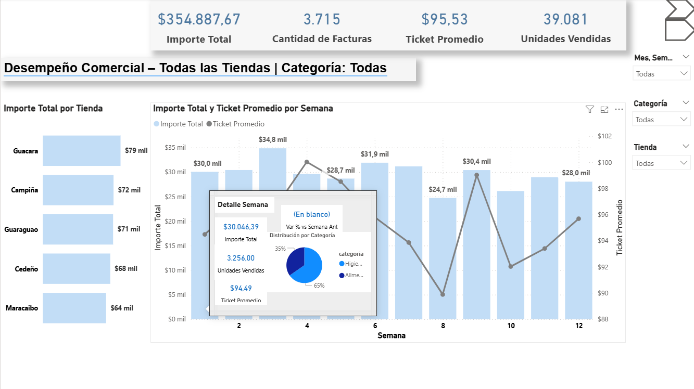
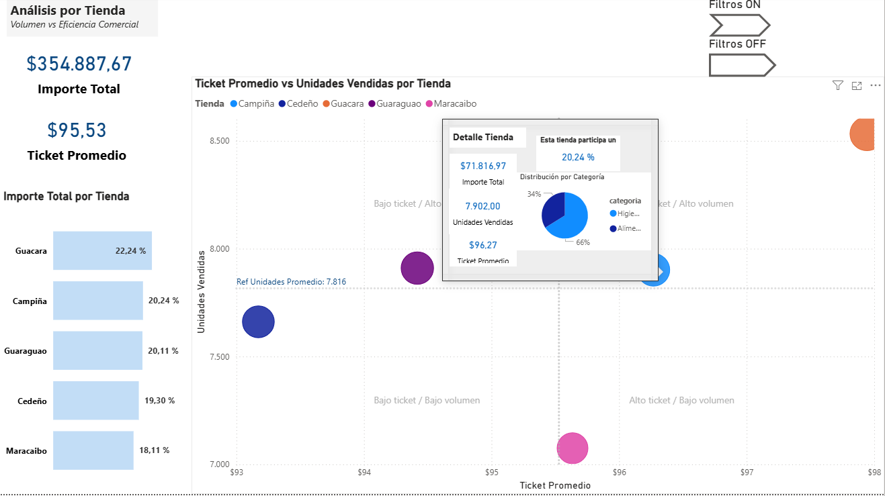

# 📊 Desempeño Comercial – Power BI Dashboard

Dashboard desarrollado en **Power BI Desktop** con datos simulados, orientado al análisis del desempeño comercial en un entorno **multitienda**, con foco en **volumen de ventas, eficiencia comercial y participación por tienda**.

El proyecto pone especial énfasis en **modelado de datos**, **medidas DAX contextuales** y **experiencia de usuario (UX)**, priorizando claridad visual y capacidad de análisis sin sobrecargar las vistas principales.

---

## 🎯 Objetivo del Dashboard

Permitir a usuarios ejecutivos y analistas responder de forma rápida y clara a preguntas como:

- ¿Cómo evoluciona el desempeño comercial a lo largo del tiempo?
- ¿Qué tiendas aportan más al total de ventas?
- ¿Qué tiendas son más eficientes (ticket alto) y cuáles tienen mayor volumen?
- ¿Dónde existen oportunidades de crecimiento o mejora comercial?

---

## 🧱 Modelo de Datos

El dashboard se construyó bajo un **esquema estrella**, compuesto por:

- **Fact_ventas**  
  - Fecha  
  - Código de factura  
  - Producto  
  - Tienda  
  - Unidades vendidas  
  - Importe  

- **Dim_Tiendas**  
  - Código de tienda  
  - Nombre  
  - Región  

- **Dim_Productos**  
  - Categoría  
  - Familia  
  - Precio  
  - Costo  

- **Tabla Calendario**  
  - Fecha  
  - Semana  
  - Mes  
  - Año  

La tabla calendario se utiliza para garantizar cálculos temporales correctos (variaciones, comparaciones semanales, etc.).

---

## 📄 Estructura del Dashboard

### 🔹 Página 1 – Visión Ejecutiva
- KPIs principales:
  - Importe Total  
  - Cantidad de Facturas  
  - Ticket Promedio  
  - Unidades Vendidas  
- Análisis temporal:
  - Importe total y ticket promedio por semana  
- Ranking:
  - Importe total por tienda  
- Elementos UX destacados:
  - **Panel de filtros oculto** mediante bookmarks  
  - **Título dinámico** según tienda y categoría seleccionadas  
  - **Tooltips personalizados** con métricas detalladas y variación vs semana anterior
    
  
---

### 🔹 Página 2 – Análisis por Tienda
- Scatter plot:
  - **Ticket Promedio vs Unidades Vendidas**
  - Tamaño del punto: Importe total
- Líneas de referencia:
  - Ticket promedio global
  - Promedio de unidades por tienda
- Identificación visual de cuadrantes:
  - Alto ticket / Alto volumen  
  - Alto ticket / Bajo volumen  
  - Bajo ticket / Alto volumen  
  - Bajo ticket / Bajo volumen  
- Tabla de apoyo:
  - Participación porcentual por tienda
- Tooltips por tienda:
  - Importe
  - Unidades
  - Ticket promedio
  - % de participación
  - Distribución por categoría
    
  
---

## 🧠 Medidas DAX Destacadas

- Ticket Promedio
- Participación porcentual por tienda
- Variación porcentual vs semana anterior
- Referencias dinámicas para líneas de cuadrante
- Títulos dinámicos basados en contexto de filtros

Las medidas fueron diseñadas para **respetar el contexto de análisis** (fecha, categoría) y aislar correctamente dimensiones cuando es necesario (por ejemplo, participación por tienda).

---

## 🎨 Experiencia de Usuario (UX)

El diseño prioriza:

- Jerarquía visual clara
- Información bajo demanda (tooltips)
- Reducción de ruido visual
- Filtros accesibles pero no intrusivos
- Navegación intuitiva entre vistas

Este enfoque permite que el dashboard sea útil tanto para **usuarios ejecutivos** como para **analistas de negocio**.

---

## 🛠️ Herramientas Utilizadas

- Power BI Desktop  
- DAX  
- Power Query  
- Excel (datos simulados)

---

## 📌 Nota sobre los datos

Los datos utilizados en este proyecto son **simulados**, diseñados para replicar comportamientos reales de un entorno retail, y se emplean exclusivamente con fines demostrativos y de portafolio.

## 👤 Autora

**Lorena Carrillo**  
Data Analyst / Power BI Developer  
Especialización en análisis de negocio y visualización de datos

